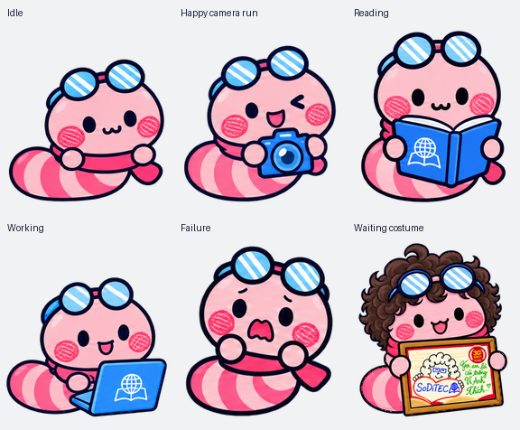
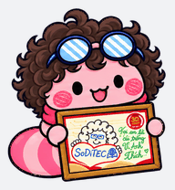

# SodiWorm — Sâu hồng của SoDiTEC

Sâu hồng là linh vật của **CLB Chuyển đổi số trong Giáo dục — SoICT Digital Transformation in Education Club (SoDiTEC)**, thuộc **Trường Công nghệ Thông tin và Truyền thông, Đại học Bách khoa Hà Nội**.

Chúng mình mong muốn Sâu hồng, cũng như các thành viên SoDiTEC, có thể đồng hành cùng các bạn trên con đường học tập, mang đến một chút niềm vui và sự đáng yêu cho mọi người. 💗

Repository này lưu trữ phiên bản SodiWorm dành cho tính năng desktop pet của Codex.



## Các hoạt động

- Nghỉ ngơi, chớp mắt và chuyển động nhẹ.
- Di chuyển trái/phải với biểu cảm vui vẻ và máy ảnh.
- Chào hỏi, nhảy và phản ứng khi gặp lỗi.
- Làm việc trên laptop và đọc sách có biểu tượng quả địa cầu trên quyển sách mở.
- Chờ đợi với tóc xoăn hóa trang và khung ảnh SoDiTEC. Tóc xoăn chỉ xuất hiện trong hoạt động này.
- Nhìn theo con trỏ với 16 hướng.



## Cấu trúc thư mục

```text
.
├── README.md
├── LICENSE
├── .gitignore
├── assets/                 # Hình ảnh và chuyển động xem trước
└── pets/
    └── SodiWorm/
        ├── pet.json        # Cấu hình desktop pet
        ├── spritesheet.png # Sprite atlas có nền trong suốt
        ├── animation-mappings.json
        ├── preview.html    # Xem trước các hoạt động trong trình duyệt
        ├── README.md
        └── LICENSE
```

## Xem trước và cài đặt

**Việc sử dụng hình ảnh, bao gồm sử dụng desktop pet, cần có sự cho phép trước của SoDiTEC theo [LICENSE](LICENSE).** Repository công khai không đồng nghĩa với việc cấp quyền sử dụng hình ảnh.

Sau khi được CLB cho phép:

1. Tải hoặc clone repository.
2. Mở `pets/SodiWorm/preview.html` để xem các hoạt động.
3. Sao chép toàn bộ thư mục `pets/SodiWorm` vào thư mục `pets` trong Codex home, thường là `%USERPROFILE%\.codex\pets` trên Windows.
4. Làm mới danh sách tại **Settings → Pets** và chọn **SodiWorm**.

Gói sử dụng sprite phiên bản 2: atlas **1536 × 2288 px**, ô **192 × 208 px**, 9 hoạt động và 16 hướng nhìn, tổng cộng 73 khung hình. `animation-mappings.json` mô tả ánh xạ cố định của ứng dụng; ứng dụng đọc `pet.json` để tải pet.

## Ghi công và bản quyền

**Bản quyền thuộc CLB Chuyển đổi số trong Giáo dục SoDiTEC.** Hình tượng Sâu hồng được thiết kế bởi **Ban Truyền thông của CLB**, do **Đỗ Hà Chi** và **Trần Ngọc Mai** phụ trách thiết kế.

Các bên không được sử dụng hình ảnh của CLB vào bất kỳ mục đích nào khi chưa xin ý kiến và nhận được sự cho phép của CLB. Vui lòng liên hệ trực tiếp SoDiTEC để xin phép; phạm vi sử dụng thực hiện theo nội dung được CLB chấp thuận.

Chi tiết tại [LICENSE](LICENSE).
